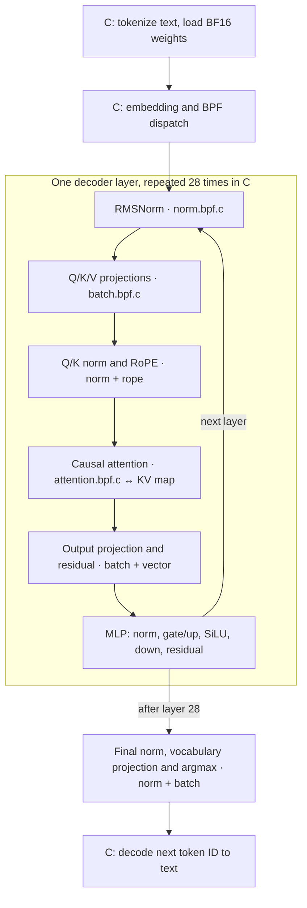

# Qwen3-0.6B in Linux eBPF (experimental)

An experimental C/libbpf implementation of Qwen3-0.6B forward
computation in Linux eBPF. The current milestone runs **all 28 decoder layers
for multi-token contexts**, projects to the full vocabulary, and produces the
next token ID in the kernel. Greedy decoding can reuse the cache to produce
additional token IDs. The KV cache lives in a BPF array map; the attention
operator writes new K/V pairs and scans up to 256 prior positions per
invocation using `bpf_loop`.
The default host path loads and converts official BF16 weights, dispatches
bounded BPF tiles, and reads results; an optional arena path instead passes
BF16 rows to BPF for exact Q24 lookup. Model arithmetic and argmax run in eBPF. A C
ByteLevel/BPE tokenizer handles text at the edge. No model weights or tokenizer
data are distributed here.

## How one token is computed



The diagram shows *multiple bounded BPF program invocations*, not one
long-running kernel program. C chooses the operator order and supplies the
current weights and vectors. The attention program owns the BPF KV map; its
cached K/V vectors are reused when the next token runs through the layers.
The default path converts active BF16 rows to Q24 in C. The optional BF16
arena path moves that conversion into BPF for one batch at a time; neither
path keeps the entire model in the arena.

| Kernel program | Role in full inference |
| --- | --- |
| `qwen3_batch.bpf.c` | Bounded matrix rows for Q/K/V, output, MLP, and vocabulary projection; tracks the winning vocabulary logit. |
| `qwen3_norm.bpf.c` | RMSNorm, including Q/K and final normalization. |
| `qwen3_rope.bpf.c` | Rotates query and key heads using sine/cosine values supplied by C. |
| `qwen3_attention.bpf.c` | Causal attention and BPF-map KV-cache writes/reads. |
| `qwen3_silu.bpf.c`, `qwen3_vector.bpf.c` | MLP activation, gating multiply, and residual additions. |
| `qwen3_arena_bf16.bpf.c` | Optional exact-weight, bounded arena-batch alternative to `qwen3_batch.bpf.c`. |

`qwen3_matvec.bpf.c`, `qwen3_int4.bpf.c`, `qwen3_int8.bpf.c`, and
`qwen3_arena_int4.bpf.c` are separate operator experiments, not the default
full-model path. See the implementation notes below for their evidence and
limits.

## Implementation notes and experiments

`src/qwen3_matvec.bpf.c` runs integer multiply-accumulate in a socket-filter
BPF program, with Q8×Q8 and Q16-activation×Q24-weight paths.
`src/matvec-smoke.c` invokes it with `bpf_prog_test_run_opts`,
checks the map result after bounded 128-element tiles, and compares against a C
reference. That operator test alone does not establish model inference; the
separate inference driver below connects all decoder layers.
The same BPF program also accepts a caller-supplied tile count; `make test`
now checks a 3,072-element path (24 tiles), matching Qwen3's MLP intermediate
width. The original tile program remains an operator test. Full inference now
uses `src/qwen3_batch.bpf.c`: `bpf_loop` computes up to 128 complete matrix
rows per invocation. Its approximately 1.51 MiB work map is memory-mapped
into C, so the driver writes weights and activations and reads results without
per-batch map update/lookup syscalls. The BF16 model file is mapped read-only
once, avoiding per-row file seeks, reads, and allocations; active rows are
still converted to Q24 in C for each forward pass on the default path.

`src/qwen3_int4.bpf.c` separately tests a 16-row, group-128 signed-INT4
matrix operator with packed nibbles and Q24 group scales. Its operator smoke
test checks the BPF result against the same packed calculation in C; it is not
used by the complete inference driver.

`src/qwen3_int8.bpf.c` separately tests a 128-row, group-32 signed-INT8
operator with Q32 group scales and fused argmax. Its synthetic and official
model-row checks pass on the test kernel. The complete driver does not select
it: the exploratory whole-model integration described below did not establish
the required generation fidelity or speedup.

`src/qwen3_arena_int4.bpf.c` is an optional arena-resident version of that
operator: C writes 16 packed rows and their scales into a shared BPF arena,
and the BPF matrix callbacks read weights directly from the arena instead of
copying them into the per-invocation work map. On Linux 6.17 arm64 with Clang
19, libbpf 1.7, and bpftool 7.7, its synthetic 16-row check matched the C
integer reference. With an official model row, BF16, C INT4, and BPF arena
INT4 dots were `0.125738472`, `0.119238757`, and `0.119232178` (the same
INT4 result as the non-arena operator). This proves a bounded arena weight
read, not whole-model weight residency, acceptable INT4 generation quality,
or a speedup. It is not in the default `make test` or inference path because
the latter still uses the portable, more accurate Q24 path.

`src/qwen3_arena_bf16.bpf.c` provides a separate exact-weight route: it keeps
raw BF16 matrix rows and a 65,536-entry BF16-to-Q24 lookup table in the
arena. BPF reads a BF16 value, obtains the same Q24 integer used by the
default driver, and computes the dot product without C converting or copying
Q24 weights for that invocation. The optional `build/infer-arena-bf16` driver
reuses a roughly 2 MiB arena for batches of 128 rows rather than loading the
whole model into it. On the test kernel, 128 synthetic and 128 official
Q-projection rows matched the C Q24 reference. Complete inference for input
token `0` and the two-token `Hello, world!` generation returned the same
token IDs and byte-identical 151,936 logits as the default path. Six
interleaved one-token runs measured 1.227/1.190/1.251 s on the default
path and 1.220/1.228/1.234 s with the arena path; these samples do not show
a stable speedup. The optional path needs arena-capable Linux/libbpf and is
not the default build.

`src/qwen3_norm.bpf.c` implements RMSNorm in one BPF invocation. Two bounded
`bpf_loop` callbacks accumulate and apply up to eight 128-element tiles around
the integer-square-root step. Its work map is memory-mapped, so C can supply
the full vector and read the result without per-tile map syscalls. An earlier
monolithic implementation exceeded the verifier's one-million-instruction
processing budget on the test kernel; the callback-based version passed on
that kernel. RMSNorm weights use Q20 rather than Q24 because the official
model contains weights above Q24's representable range.
`src/qwen3_silu.bpf.c` approximates SiLU entirely with integer operations in
eBPF, without a user-space lookup or per-input host computation. It now
handles the complete 3,072-element MLP gate in one `bpf_loop` invocation
through a memory-mapped work map.
`src/qwen3_vector.bpf.c` implements residual addition and MLP gating
multiply in eBPF. In the complete inference path, the matrix callback
also tracks the best vocabulary logit as it projects each row, avoiding a
separate pass over the output vector. Addition and multiplication process
up to 3,072 elements per BPF invocation via bounded `bpf_loop` tiles and a
memory-mapped work map.
`src/qwen3_rope.bpf.c` rotates paired half-head dimensions in eBPF. A bounded
`bpf_loop` processes all 16 query and eight key heads in one invocation per
layer; C supplies their shared sine/cosine values once per layer.
`src/qwen3_attention.bpf.c` computes Q·K scores and an online, stable
softmax/V reduction for each prior position. It writes new K/V pairs into a
BPF map, then traverses its history in bounded `bpf_loop` chunks; C supplies
the new K/V vectors through the attention work map. `src/infer.c`
composes these operators with all model
tensors, including Q/K projection, QK normalization, RoPE, causal attention,
and grouped-query head sharing. The KV map is sized to the requested input
and generation length; the cached vectors and attention arithmetic are
produced in eBPF.
For a one-token context, attention softmax has exactly one entry and is exactly
1. Longer contexts exercise the actual Q/K and attention path.

## Build and run

On a Linux host with clang's BPF target, libbpf, libelf, zlib, json-c, and
Oniguruma development headers, make, and BPF loading privileges:

```sh
make test
make test-tokenizer TOKENIZER=/path/to/tokenizer.json
```

If Clang 19, libbpf with arena support, and bpftool are available, the
separate arena operator checks are `make test-arena-int4` and
`make test-arena-bf16`, each optionally with
`MODEL=/path/to/model.safetensors`. Without `MODEL`, each runs the synthetic
check only. `ARENA_LIBBPF_INCLUDE`, `ARENA_UAPI_INCLUDE`, and
`ARENA_LIBBPF` can point to an external recent libbpf build; the normal
build does not need these dependencies.

To build and run full-model inference with bounded BF16 arena batches on
that newer toolchain, use `make build/infer-arena-bf16` and invoke it with
the same arguments as `build/infer`. The model stays in the read-only
Safetensors mapping; C copies each active BF16 batch into the arena, and BPF
does the BF16-to-Q24 lookup and matrix dot. This is kernel-side weight access,
not whole-model weight residency.

The test loads an ephemeral BPF program and map; it attaches to no network
interface and installs nothing persistently.

To test against an actual Qwen3-0.6B tensor, obtain the official
`model.safetensors` separately and run:

```sh
./build/matvec-smoke build/qwen3_matvec.bpf.o /path/to/model.safetensors
./build/matvec-smoke build/qwen3_matvec.bpf.o /path/to/model.safetensors --q24
./build/norm-smoke build/qwen3_norm.bpf.o /path/to/model.safetensors
# or run both model-backed checks:
make test-model MODEL=/path/to/model.safetensors
```

This reads the first 1,024 BF16 weights from layer 0's Q-projection matrix,
quantizes that row to Q8 or Q24 in the loader, and performs its dot product
against a deterministic synthetic activation in eBPF. The loader's C dot
product is used only as an independent assertion. This is still **not** a
transformer forward pass by itself; the driver below performs that path.

Run the complete forward path with input token IDs or text (up to the model's
40,960 position limit):

```sh
./build/infer /path/to/model.safetensors 0
./build/infer /path/to/model.safetensors 0 1 2 3
./build/infer /path/to/model.safetensors 0 1 --generate 2
./build/infer /path/to/model.safetensors \
  --tokenizer /path/to/tokenizer.json --prompt "Hello, world!" --generate 2
# Optional: write all 151,936 Q16 logits for an external comparison.
./build/infer /path/to/model.safetensors 0 --dump-logits logits.i32
```

The token-ID mode reports generated IDs. Text mode tokenizes the prompt in C,
prints decoded bytes to stdout, and sends progress/ID diagnostics to stderr.
For a chat prompt, include the Qwen3 control tokens and role delimiters in the
text supplied to `--prompt`; the CLI does not invent a chat template.
`--generate` defaults to 1 and stops early on Qwen's end-of-turn ID `151645`.
Set `QWEN3_TRACE=1` for intermediate range diagnostics. The tokenizer is
loaded from the official `tokenizer.json` at runtime; it is not vendored.

## Measurements and validation

First measured run (2026-09-24): Linux 6.17.0 arm64, Ubuntu 24.04 build
container, BPF program accepted by the kernel verifier. The synthetic row
returned `-1345`. For the official layer-0 Q-projection row, Q8 gave
`-0.0366821289` and Q24 gave `-0.0083770752`, versus the original BF16 C
reference `-0.00837016106`. Both integer accumulators matched independent C
assertions across eight BPF invocations. This one-row result shows why Q8 is
insufficient for cancellation-heavy operations; it does not bound whole-model
error. The downloaded model file's SHA-256 was
`f47f71177f32bcd101b7573ec9171e6a57f4f4d31148d38e382306f42996874b`;
it is not included in this repository.
The official tokenizer used for validation had SHA-256
`aeb13307a71acd8fe81861d94ad54ab689df773318809eed3cbe794b4492dae4`.

The layer-0 input RMSNorm check with its actual BF16 scale weights passed on
the same kernel, with maximum absolute error `7.4e-05` across 1,024 elements
against a C floating-point reference for a deterministic input vector. This
is a one-vector operator test, not a complete-layer accuracy guarantee.
The SiLU check passed with maximum absolute error `0.000634` across 128 and
3,072 inputs in `[-8, 8]` against a C floating-point reference. The inference
driver combines it with the MLP gate and up projections.
The 128-wide Q/K RMSNorm check passed with maximum absolute error `0.000597`;
RoPE's test at positions 0, 1, 7, and 63 had maximum error `1.56e-05`.
The online attention operator passed synthetic one-head tests with 1, 2, 4,
8, 16, and 257 positions; the worst maximum absolute error was `0.000905`.
The 257-position case crosses a 256-item `bpf_loop` chunk boundary and matches
the former one-KV-pair-per-invocation path byte for byte. It does not validate
a full 257-token model forward pass.

The full layer-0 V-projection matrix (1,024 rows, 1,048,576 MACs) then ran
through the BPF matvec with official weights and deterministic activations.
Its maximum per-row absolute error against the independent BF16 C reference
was `1.53e-05`; the measured operator test took `0.018 s` on the test host.
The model file is opened once and its tensor offset resolved once for this
matrix. This timing excludes model download, compilation, and the rest of a
decoder layer; it is not an LLM throughput claim.

The end-to-end one-token run used the same official weights on Linux
6.17.0 arm64. Input token IDs `0` and `1` produced IDs `9` and `14582`,
respectively, matching Hugging Face Transformers 5.14.1 BF16 reference runs.
Across all 151,936 logits, the kernel Q16 output versus that reference had
mean absolute error `0.052` / `0.030` and RMSE `0.065` / `0.038` for the
two inputs. The top three IDs agreed for both. Measured forward times were
8.47 s and 8.57 s, excluding model download, compilation, and container
startup. These are two-input experimental checks, not a general accuracy or
performance guarantee.

After the batched, mmap-backed matrix change, a same-host run in the same
Ubuntu 24.04 container measured 8.526 s for the previous tile driver and
3.695 s for the new driver on input token `0`. Their 151,936 Q16 logits
matched byte for byte. The new driver also produced ` This` for the
`Hello, world!` text prompt in 8.817 s, and generated `220, 16` from
`[0, 1]` in 6.866 s; both corresponding logit dumps matched the prior
kernel runs byte for byte. Each duration is a single run, not a throughput
distribution or proof of a general speedup. The inference workload remains
far slower than conventional optimized model inference.

With the then-mmap-backed KV cache and batched attention path, a same-host
single run measured 2.790 s for input token `0` and 7.502 s for
`Hello, world!`. The `[0, 1]` two-token generation run took 5.736 s.
Their full-vocabulary logits matched the preceding kernel implementation
byte for byte. These isolated timings are not statistically stable speedup
estimates, and the cache still uses a dense map allocation proportional to
the requested context length. The kernel scans history in chunks rather
than one unbounded invocation; large-context capacity and latency have not
been validated.

Mapping the BF16 model file read-only removed the repeated file I/O syscalls.
In one-token `strace -c` runs, the earlier driver made 496,730 `lseek`,
291,467 `read`, and 143,667 `bpf` calls; the mapped driver made 143,667
`bpf` calls and only 20 `read` calls. A separate warm-cache one-token run
measured 2.912 s before and 2.695 s after this change, with byte-identical
full-vocabulary logits. These are individual observations, not a controlled
benchmark or a speedup guarantee; many operator dispatches remain.

Increasing the matrix batch from 4 to 16 rows reduced one-token `bpf`
syscalls from 143,667 to 50,667 in the same test container. Individual
one-token runs measured 2.695 s at 4 rows and 1.605 s at 16 rows. An
experimental 32-row version loaded and returned identical logits, but its
single measured 1.626 s did not establish a further benefit at that point.
The 16-row path also reproduced the earlier byte-identical logits for
`Hello, world!` and `[0, 1] --generate 2`.
These timings are exploratory, not a controlled performance distribution.

On 2026-09-25, larger `bpf_loop` batches were tested on the same host with
the accurate Q24 path. The 128-row version loaded, passed the matrix smoke
test, and produced byte-identical full-vocabulary logits to 16 and 256 rows
for `Hello, world!` and `[0, 1] --generate 2`; the latter also generated the
same two token IDs. One-token `bpf` calls fell from 43,168 at 16 rows to
16,043 at 128 rows. Interleaved `Hello, world!` timings were 3.624/3.733 s
at 16 rows and 3.276/3.208 s at 128 rows. Additional interleaved 128- and
256-row timings overlapped, so 128 rows is retained with roughly half the
work-map size of 256 rows. These are small, noisy same-host samples, not a
general throughput claim; the one-token timing did not show a stable gain.

The vocabulary projection now accumulates argmax inside the same BPF matrix
callbacks. On the same host, this reduced one-token `bpf` calls from 16,043
to 12,482 without changing any full-vocabulary logits or generated IDs for
token `0`, `Hello, world!`, or `[0, 1] --generate 2`. Six interleaved
`Hello, world!` runs measured 3.029/3.184/3.212 s before and
3.380/3.074/3.116 s after; the syscall reduction is clear, but these
samples do not establish a latency improvement.

The residual-add and MLP-multiply operators now process a complete 1,024-
or 3,072-element vector per invocation rather than making a map update,
test-run, and lookup for every 128-element tile. On the same host, one-token
`bpf` calls fell from 12,482 to 9,205. The 128- and 3,072-element operator
tests passed, and token `0`, `Hello, world!`, and `[0, 1] --generate 2`
retained byte-identical full-vocabulary logits. This establishes fewer
syscalls, not a stable latency gain.

RoPE now batches all 24 query/key heads per layer in one BPF invocation,
using a memory-mapped work map and one shared set of trigonometric inputs.
One-token `bpf` calls fell from 9,205 to 7,217. Operator tests passed for
one and 24 heads at positions 0, 1, 7, and 63; token `0`, `Hello, world!`,
and `[0, 1] --generate 2` retained byte-identical full-vocabulary logits.
Six interleaved `Hello, world!` runs measured 3.195/3.256/3.064 s before
and 3.130/3.168/3.176 s after. The syscall reduction is clear, but the
latency samples overlap.

SiLU now computes all 24 MLP tiles in one BPF invocation instead of making
one map update, test-run, and lookup per tile. The 128- and 3,072-element
operator checks passed on the same kernel. Token `0` and `Hello, world!`
retained byte-identical full-vocabulary logits, and `[0, 1] --generate 2`
still produced IDs `220, 16`. One-token `bpf` calls fell from 7,217 to
5,229. This is a measured syscall reduction, not a controlled wall-clock
speedup claim.

Q/K RMSNorm now processes all 16 query and eight key heads in one bounded
`bpf_loop` invocation per layer. An official-weight operator check matched
the previous 24 separate BPF calls element for element; complete-vocabulary
logits for token `0`, `Hello, world!`, and a two-token generation check were
byte-identical. With both versions loading the same BPF object, one-token
`bpf` calls fell from 5,231 to 4,587, exactly 644 fewer calls across 28
layers. Three interleaved warm one-token runs took 1.204/1.242/1.199 s
before and 1.221/1.138/1.209 s after. The calls fell, but these timings
do not establish a latency gain.

Cached attention now processes all 16 query heads in one BPF invocation per
256-position chunk, reading the same BPF KV array as before and reusing
each KV lookup for its two query heads. An operator check across all heads
and 257 positions matched the per-head BPF path element for element. Token
`0`, `Hello, world!`, and two-token generation
retained byte-identical full-vocabulary logits. One-token `bpf` calls fell
from 4,587 to 4,169 across the two builds; the new object adds two setup
calls, while the execution path saves 15 calls per layer, or 420 per token.
Three warm one-token runs of the new path took 1.186/1.017/1.016 s; these
small, non-interleaved samples do not establish a latency improvement.

The attention program now stores each newly projected K/V pair in the BPF
KV array before scanning history. The host supplies the new vectors through
the small attention work map but no longer maps or writes the cache directly.
An eight-KV-head operator test verified the stored values and the same-call
attention output; token `0`, `Hello, world!`, and two-token generation kept
byte-identical full-vocabulary logits. The one-token `bpf` call count stayed
at 4,169. This moves cache maintenance into BPF, not the whole scheduling
loop, and has not established a latency gain.

Weight preparation now maps each of the 65,536 possible BF16 bit patterns to
its Q24 value once per process, then converts active matrix rows by lookup.
An exhaustive conversion test checks representable finite patterns against
the previous floating-point formula and rejects non-finite or out-of-range
values. Three interleaved one-token runs on the same host measured
1.425/1.576/1.476 s for the previous conversion and 1.154/1.258/1.049 s
for the lookup path. The latter produced byte-identical full-vocabulary Q16
logits for token `0`, `Hello, world!`, and `[0, 1] --generate 2`. These are
small exploratory samples, not a stable throughput or cross-host speed claim.
The lookup table occupies about 512 KiB; weight conversion still happens in C
for each active matrix row, not in BPF or in a resident weight arena.

Collapsing each RMSNorm from separate tile calls and three stages into a
single BPF invocation reduced one-token `bpf` syscalls from 50,667 to
43,171 on the same host. The 1,024-element and 128-element operator checks
passed; token `0`, `Hello, world!`, and `[0, 1] --generate 2` retained
byte-identical full-vocabulary logits. Three interleaved one-token runs
measured 1.291/1.190/1.204 s before and 1.289/1.282/1.246 s after the
change; two interleaved `[0, 1] --generate 2` runs measured 3.282/3.183 s
before and 3.198/3.115 s after. The call reduction is verified, but these
small, variable timings do not establish a latency improvement.

The end-to-end `[0, 1]` context returned next token ID `220`, matching the
official Transformers 5.14.1 BF16 model. Across its 151,936 logits, mean
absolute error was `0.024` and RMSE `0.030`; the top three token IDs agreed.
The measured two-position forward pass took `23.38 s`, excluding model
download and compilation. This is one two-token validation input, not a
general-context accuracy guarantee.

The end-to-end `[0, 1, 2, 3]` context returned next token ID `2`, also
matching the official BF16 model. Across all 151,936 logits, mean absolute
error was `0.019` and RMSE `0.024`; the top four IDs agreed. The measured
four-position forward pass took `29.43 s`. These checks establish a real
multi-position path, not accuracy for all possible prompts or lengths.

With input `[0, 1]` and `--generate 2`, greedy cache-reusing decoding returned
`220, 16`. The official BF16 model agreed on both IDs; for the second output
(context `[0, 1, 220]`), full-vocabulary MAE was `0.025` and RMSE `0.031`.
This verifies one incremental step, not long-form generation quality.

The C tokenizer matched the official tokenizer on English, Chinese, emoji,
whitespace, mixed text, and chat control-token vectors, including byte-level
decode roundtrips. The text prompt `Hello, world!` became the official IDs
`[9707, 11, 1879, 0]` and generated ` This` (ID `1096`). The official BF16
model agreed on that ID and all top-five IDs; full-vocabulary MAE was `0.035`
and RMSE `0.044`. This is one text-prompt accuracy check.

## General-context target and hard problems

The target is [Qwen3-0.6B](https://huggingface.co/Qwen/Qwen3-0.6B), not a
toy transformer: 28 decoder layers, 1,024 hidden width, grouped-query
attention, QK normalization, RoPE, RMSNorm, SiLU, KV cache, and a 151,936-token
vocabulary. The multi-position path uses the full model's weights and all
28 layers. Remaining research includes broader numerical validation, long
contexts, generation quality, verifier portability, and throughput. The
four-token result must not
be extrapolated to arbitrary contexts. The user-space driver may load weights,
tokenize, invoke BPF, and read output, but cannot
substitute user-space model math for kernel forward computation.

### Current boundary and limits

The model's dense arithmetic, attention reduction, and argmax run in BPF.
Tokenization and text decoding remain in C: the exact tokenizer loads a large
JSON vocabulary, uses Oniguruma regex splitting and dynamic BPE data
structures, and turns token IDs back into bytes. Moving that I/O path into
verified BPF would require a separate bounded implementation and would not
remove the dense matrix cost. C also loads BF16 tensors, converts each active
row to Q24, calculates RoPE trigonometric inputs, and dispatches operators.
These are real host-side responsibilities, not hidden kernel inference.

`bpf_loop` now batches 128 matrix rows, up to eight RMSNorm tiles, all 24 Q/K
normalization heads, up to 24 vector or SiLU tiles or RoPE heads, and up to
256 attention-history items across all query heads per invocation. It does
not turn a 28-layer model into one BPF invocation:
matrix batches, normalization calls, and token-by-token generation still
cross the user/kernel boundary. Bounded units keep verifier complexity and
per-invocation runtime manageable. The attention smoke test crosses the
256-item boundary, but a full long-context model run
has not been validated.

Mmap-backed arrays are sufficient for the current inference working buffers;
the KV cache is a separate BPF array written by the attention program. Only
the optional INT4 operator and full-model BF16 arena path read arena-resident
weight batches; the whole model is not resident there. The BF16 lookup path
preserves Q24 integer weights without storing them as four-byte values, but
whole-model arena residency remains untested and the bounded path did not
show a stable speedup. Arena allocation alone would
not make 0.6B parameters fit cheaply or remove their conversion cost.
The current KV layout reserves 1,024 bytes for each position/layer/KV-head
pair, about 224 KiB per position and 8.75 GiB at 40,960 positions, before
weights and other buffers. It may fail under real memory limits. Q24 is the
current arithmetic quantization, converted from the official BF16 file each
forward pass. One Q8 row test showed substantial error, so the code does not
advertise Q8 as a drop-in replacement.
Two exploratory variants were not retained. Converting BF16 to Q24 inside
the 3,072-column BPF loop failed verifier loading on the test kernel with
`The sequence of 8193 jumps is too complex`. Per-row scaled int16 weights
loaded and kept the same top token for input `0`, but the 151,936 logits had
mean absolute difference `0.00517` from the Q24 path, while two warm-cache
single-token runs took 3.30 s and 3.17 s versus 1.61 s for the Q24 path.
These are exploratory measurements. A separate self-contained Safetensors
variant preconverting all rank-2 BF16 tensors to I32 Q24 was also tested and
not retained. Its one-token logits matched the existing path byte for byte,
but its file grew from 1,503,300,328 to 3,006,434,093 bytes. Interleaved
same-host runs on input `0` took 5.18/3.93 s with the preconverted file
versus 3.22/2.37 s with the original BF16 file. The host had only about
4.6 GiB available memory during this test, so file size and cache pressure
may explain part of the regression; no isolated cause or general speed claim
is established. Conversion itself took about 8 s. This tests prepacked Q24,
not an efficient lower-bit representation; a reusable, smaller quantized
weight layout with whole-model accuracy and speed evidence remains open.

A further exploratory full-model INT4 path was tested and not retained as an
inference option. It prepacked the matrices used by the driver into
316,616,704 bytes of signed 4-bit weights plus group-128 Q24 scales, taking
1.928 s in one run before forward timing started. The INT4 BPF operator
passed the verifier and synthetic and real-weight row smoke checks; on one
official Q-projection row, the deterministic BF16 dot was `0.125738472`,
the quantized C dot `0.119238757`, and BPF `0.119232178`. However, the
complete model's first generated IDs changed for inputs `0`, `1`, and
`[9707, 11, 1879, 0]`: the Q24 path returned `9`, `14582`, and `1096`,
while this naive INT4 path returned `284`, `284`, and `21927`. Full-vocabulary
logit MAE versus Q24 was `1.837`, `1.396`, and `0.981`, respectively. The
corresponding single-run forward times were `0.956/0.995/3.197 s` for INT4
versus `1.243/1.229/3.546 s` for Q24, excluding INT4 prepacking. These
small samples show a possible kernel forward-speed benefit, not a usable
quantized model or end-to-end speedup. Group-32 scales and retaining the
BF16/Q24 vocabulary projection alone did not recover token `9` for input
`0`; quantizing only MLP matrices still changed it to `284`. A no-INT4
control with the same experimental driver returned `9`, so the mismatch was
not caused merely by loading the extra BPF object. A calibrated or mixed-
precision scheme needs full-model accuracy validation before integration.

A separate group-32 INT8 experiment also passed the verifier and its
128-row synthetic operator test. On one official Q-projection row, BF16, C
INT8, and BPF INT8 dots were `0.125738472`, `0.125476453`, and
`0.125473022`. A temporary full-model driver, not retained in `infer`,
generated the same first IDs as Q24 for input tokens `0` and `1` (`9` and
`14582`), but for the exact text `Hello, world!` it generated `20166`
instead of Q24's `1096`. On that four-token prompt, measured end-to-end
times were `8.027 s` for on-the-fly INT8 quantization and `3.310 s` for
Q24 on the same host; the respective one-token `0` times were `2.630 s`
and `1.183 s`. These are single runs, not a throughput benchmark. Keeping
MLP matrices at Q24 still changed the four-token prompt's first ID to
`20166`; using finer 16-weight INT8 groups did not establish fidelity.
An INT8 format may be useful with calibration, better mixed precision, and
reusable prepacking, but this experiment is not a drop-in replacement.

This is a research prototype. It is not intended for production kernels or
performance-sensitive traffic. The project code is MIT licensed; Qwen model
weights, if obtained separately, retain their own Apache-2.0 license.

## Related work and novelty boundary

CPU-only C Qwen3 implementations already exist, as do CUDA Qwen3-0.6B
implementations. An existing eunomia-bpf tutorial profiles a CUDA Qwen3
engine with eBPF; its model arithmetic runs on the GPU, not in eBPF. KernelX
puts an eBPF signal path in front of a user-space LLM, while published eBPF
work has run much smaller neural networks in the kernel. As of September 2026,
our search did not find a public full
Qwen3-0.6B Linux-eBPF forward-pass implementation. That is a search result,
not proof of absolute novelty.

- [Qwen3-0.6B model and configuration](https://huggingface.co/Qwen/Qwen3-0.6B)
- [Qwen3-0.6B tokenizer.json](https://huggingface.co/Qwen/Qwen3-0.6B/blob/main/tokenizer.json)
- [Hugging Face ByteLevel mapping source](https://github.com/huggingface/tokenizers/blob/main/tokenizers/src/pre_tokenizers/byte_level.rs)
- [qwen3.c, CPU-only C](https://github.com/adriancable/qwen3.c)
- [qwen3.cu, CUDA](https://github.com/gigit0000/qwen3.cu)
- [eunomia-bpf CUDA Qwen3 profiling tutorial](https://github.com/eunomia-bpf/bpf-developer-tutorial/blob/main/src/xpu/flamegraph/README.md)
- [KernelX, eBPF/user-space LLM bridge](https://github.com/pie-314/KernelX)
- [Linux BPF verifier documentation](https://docs.kernel.org/bpf/verifier.html)
