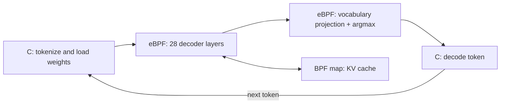

# Qwen3 eBPF

**Run Qwen3-0.6B model arithmetic inside the Linux kernel.**

[Quick start](#quick-start) · [Architecture](docs/architecture.md) ·
[Usage & tests](docs/usage.md) · [Experiments](docs/experiments.md) · [MIT license](LICENSE)

An experimental C/libbpf implementation of Qwen3-0.6B forward computation in
Linux eBPF. It runs **all 28 decoder layers**, maintains a kernel KV cache,
projects to the full vocabulary, and returns a next-token ID. The default CLI
uses C to schedule bounded BPF operators. A separate XDP path instead keeps
BF16 model weights in a BPF arena, schedules inference through a BPF workqueue
after a real packet, and returns the result in a UDP packet. Text tokenization
remains client-side. No model weights or tokenizer data are distributed here.

## Quick start

Use a Linux development host with BPF loading privileges. The recorded test
environment is Linux 6.17 arm64; this is a research prototype, not a production
inference engine. See [dependencies and kernel requirements](docs/usage.md#build-dependencies).

```sh
git clone https://github.com/eunomia-bpf/qwen3-ebpf.git
cd qwen3-ebpf
make
```

Obtain `model.safetensors` and `tokenizer.json` from
[Qwen3-0.6B](https://huggingface.co/Qwen/Qwen3-0.6B/tree/main) separately, then
run from the repository root:

```sh
sudo ./build/infer /path/to/model.safetensors \
  --tokenizer /path/to/tokenizer.json --prompt "Hello, world!" --generate 2
```

For raw token IDs, no tokenizer file is needed:

```sh
sudo ./build/infer /path/to/model.safetensors 0
```

Text mode writes decoded bytes to stdout and diagnostics to stderr. The driver
loads temporary BPF programs and maps; it does not attach to network interfaces.
The CLI and existing `build/` executable names remain unchanged.

For live packet-triggered inference, see the [XDP loader and client
instructions](docs/usage.md#build-and-run). Use a disposable test network
namespace or interface; this prototype is not a production network service.

## How it works


```mermaid
flowchart LR
    A["C: tokenize and load weights"] --> B["eBPF: 28 decoder layers"]
    B --> C["eBPF: vocabulary projection + argmax"]
    C --> D["C: decode token"]
    B <--> E["BPF map: KV cache"]
    D -->|next token| A
```

The diagram shows the default CLI: C schedules multiple bounded BPF
invocations, supplies embeddings and RoPE inputs, and converts active BF16
weight rows to Q24. BPF performs matrix operations, normalization, attention,
MLP operations, and argmax. The separate live XDP path loads BF16 weights into
a BPF arena once; packet arrivals trigger a BPF workqueue to schedule all 28
layers and send a UDP result. Its C loader keeps the BPF link alive, while its
client supplies token IDs or performs text tokenization. Neither path calls a
user-space LLM from an eBPF hook.

[Architecture and operator map →](docs/architecture.md)

## Repository layout

```text
src/
  infer.c                 Inference CLI and operator scheduling
  serve_xdp.c             Standalone live XDP loader
  safetensors.c           Model loading and fixed-point weight conversion
  qwen3_tokenizer.c        ByteLevel/BPE tokenizer
  bpf/                    Default operators and optional BF16 arena backend
include/                  Shared host/BPF types and interfaces
tests/                    Smoke tests and XDP token/UDP client
experiments/              Standalone matvec, INT4, INT8, and INT4 arena kernels
docs/
  architecture.md         Execution model and implementation boundaries
  usage.md                Dependencies, CLI, build targets, and contribution notes
  experiments.md          Recorded validation and experimental alternatives
```

`make` builds the default inference path. Experimental operators and test
drivers are built by their explicit targets, rather than mixed into onboarding.

## Development

```sh
make help
sudo make test
sudo make test-model MODEL=/path/to/model.safetensors
make test-tokenizer TOKENIZER=/path/to/tokenizer.json
```

The existing tests compare BPF operators with C references; they are not a
general model-quality benchmark. Optional BF16 arena inference and low-bit
operator experiments are documented in [Usage & tests](docs/usage.md).

## Status and limitations

- All 28 decoder layers, multi-token contexts, vocabulary projection, and
  greedy cache-reusing decoding are implemented.
- Recorded short-input checks agree with the BF16 reference on selected token
  IDs; this is not a guarantee for arbitrary prompts or long-form generation.
- The default path uses fixed-point arithmetic. INT4/INT8 experiments are not
  drop-in inference replacements.
- The KV cache costs about 224 KiB per requested position. The model's 40,960
  position limit is not a validated context capacity for this implementation.
- The XDP path keeps BF16 weights in kernel memory and runs all 28 layers,
  KV updates, full-vocabulary projection, and argmax in BPF. A loader must
  remain running to hold the XDP link. Requests are raw token IDs, results
  require a UDP poll, and the service has one global session rather than
  concurrent clients. The XDP KV capacity is limited to 256 positions.
- On two exact 125- and 131-token excerpts, XDP and official BF16 agreed on
  the final token; 251 of 256 online per-prefix argmax IDs matched. Four of
  the five differences were BF16 top-score ties. This is not a general
  model-quality evaluation. **No speed benefit over one-core user-space BF16
  inference was demonstrated.**
- Verifier portability, broader numerical validation, and throughput remain
  research work. Do not use this on production kernels.

Detailed results, model/tokenizer hashes, comparisons, and unsuccessful
experiments are preserved in [Experiments](docs/experiments.md).

## License

Project code is [MIT licensed](LICENSE). Model weights and tokenizer assets
are downloaded separately and retain their upstream license.

## References

- [Qwen3-0.6B model and configuration](https://huggingface.co/Qwen/Qwen3-0.6B)
- [Linux BPF verifier documentation](https://docs.kernel.org/bpf/verifier.html)
- [Related implementations and novelty boundary](docs/experiments.md#related-work-and-novelty-boundary)
