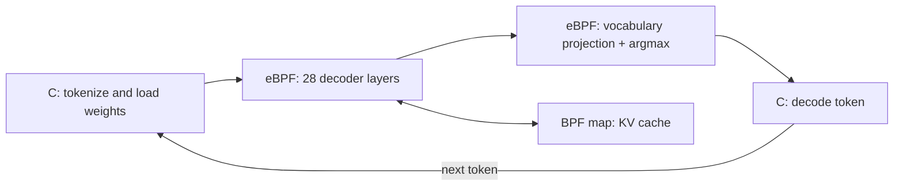

# Qwen3 eBPF

**Run Qwen3-0.6B model arithmetic inside the Linux kernel.**

[Quick start](#quick-start) · [Architecture](docs/architecture.md) ·
[Usage & tests](docs/usage.md) · [Experiments](docs/experiments.md) · [MIT license](LICENSE)

An experimental C/libbpf implementation of Qwen3-0.6B forward
computation in Linux eBPF. The current milestone runs **all 28 decoder layers
for multi-token contexts**, projects to the full vocabulary, and produces the
next token ID in the kernel. Greedy decoding can reuse the cache to produce
additional token IDs. The KV cache lives in a BPF array map; the attention
operator writes new K/V pairs and scans up to 256 prior positions per
invocation using `bpf_loop`.
The default host path loads and converts official BF16 weights, dispatches
bounded BPF tiles, and reads results; an optional arena path instead preloads
the model's BF16 payload into a BPF arena for exact Q24 lookup. Model arithmetic
and argmax run in eBPF. A C
ByteLevel/BPE tokenizer handles text at the edge. No model weights or tokenizer
data are distributed here.

## Quick start

Use a Linux development host with BPF loading privileges. The recorded test
environment is Linux 6.17 arm64; this is a research prototype, not a production
inference engine. See [dependencies and kernel requirements](docs/usage.md#build-dependencies).

```sh
git clone https://github.com/eunomia-bpf/qwen3-ebpf.git
cd qwen3-ebpf
make
```

Obtain `model.safetensors` and `tokenizer.json` from
[Qwen3-0.6B](https://huggingface.co/Qwen/Qwen3-0.6B/tree/main) separately, then
run from the repository root:

```sh
sudo ./build/infer /path/to/model.safetensors \
  --tokenizer /path/to/tokenizer.json --prompt "Hello, world!" --generate 2
```

For raw token IDs, no tokenizer file is needed:

```sh
sudo ./build/infer /path/to/model.safetensors 0
```

Text mode writes decoded bytes to stdout and diagnostics to stderr. The driver
loads temporary BPF programs and maps; it does not attach to network interfaces.
The CLI and existing `build/` executable names remain unchanged.

## How it works


```mermaid
flowchart LR
    A["C: tokenize and load weights"] --> B["eBPF: 28 decoder layers"]
    B --> C["eBPF: vocabulary projection + argmax"]
    C --> D["C: decode token"]
    B <--> E["BPF map: KV cache"]
    D -->|next token| A
```

C schedules multiple bounded BPF invocations and supplies embeddings and RoPE
trigonometric inputs. On the default path, C converts active BF16 weight rows
to Q24; on the optional resident path, BPF reads BF16 weights from its arena.
BPF performs
matrix operations, normalization, attention, MLP operations, and argmax.
This is not a single long-running kernel program, a GPU profiler, or a
user-space LLM called by an eBPF hook.

[Architecture and operator map →](docs/architecture.md)

## Repository layout

```text
src/
  infer.c                 Inference CLI and operator scheduling
  safetensors.c           Model loading and fixed-point weight conversion
  qwen3_tokenizer.c        ByteLevel/BPE tokenizer
  bpf/                    Default operators and optional BF16 arena backend
include/                  Shared host/BPF types and interfaces
tests/                    Operator, model-reader, and tokenizer smoke tests
experiments/              Standalone matvec, INT4, INT8, and INT4 arena kernels
docs/
  architecture.md         Execution model and implementation boundaries
  usage.md                Dependencies, CLI, build targets, and contribution notes
  experiments.md          Recorded validation and experimental alternatives
```

`make` builds the default inference path. Experimental operators and test
drivers are built by their explicit targets, rather than mixed into onboarding.

## Development

```sh
make help
sudo make test
sudo make test-model MODEL=/path/to/model.safetensors
make test-tokenizer TOKENIZER=/path/to/tokenizer.json
```

The existing tests compare BPF operators with C references; they are not a
general model-quality benchmark. Optional BF16 arena inference and low-bit
operator experiments are documented in [Usage & tests](docs/usage.md).

## Status and limitations

- All 28 decoder layers, multi-token contexts, vocabulary projection, and
  greedy cache-reusing decoding are implemented.
- Recorded short-input checks agree with the BF16 reference on selected token
  IDs; this is not a guarantee for arbitrary prompts or long-form generation.
- The default path uses fixed-point arithmetic. INT4/INT8 experiments are not
  drop-in inference replacements.
- The KV cache costs about 224 KiB per requested position. The model's 40,960
  position limit is not a validated context capacity for this implementation.
- The optional BF16 arena keeps model weights in kernel memory. A separate
  XDP-to-BPF-workqueue path accepts token IDs from live packets, loads their
  embeddings and first-layer RMSNorm weights from resident storage, and
  schedules all batches of the real-weight first-layer Q/K/V projections,
  then applies head-wise Q/K RMSNorm and position-dependent RoPE. A separate
  event check also stores first-layer K/V in a kernel map and computes
  attention over consecutive token packets, followed by the output projection,
  residual addition, and post-attention RMSNorm. C still schedules the 28
  layers in full inference and handles text. No full-model event path or
  end-to-end speedup has been
  established.
- Verifier portability, broader numerical validation, and throughput remain
  research work. Do not use this on production kernels.

Detailed results, model/tokenizer hashes, comparisons, and unsuccessful
experiments are preserved in [Experiments](docs/experiments.md).

## License

Project code is [MIT licensed](LICENSE). Model weights and tokenizer assets
are downloaded separately and retain their upstream license.

## References

- [Qwen3-0.6B model and configuration](https://huggingface.co/Qwen/Qwen3-0.6B)
- [Linux BPF verifier documentation](https://docs.kernel.org/bpf/verifier.html)
- [Related implementations and novelty boundary](docs/experiments.md#related-work-and-novelty-boundary)
