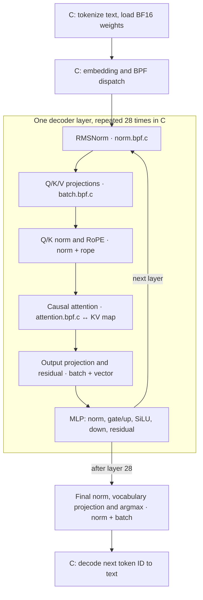

# Architecture

[Back to the project](../README.md) · [Usage](usage.md) · [Experiments](experiments.md)

## How one token is computed

The diagram shows *multiple bounded BPF program invocations*, not one
long-running kernel program. C chooses the operator order and supplies the
current weights and vectors. The attention program owns the BPF KV map; its
cached K/V vectors are reused when the next token runs through the layers.
The default path converts active BF16 rows to Q24 in C. The optional BF16
arena path loads the complete model payload into kernel-owned arena pages and
does matrix conversion in BPF. C still controls the layer sequence and reads
non-matrix weights from the model file.

The full-model driver's operators use the `socket` BPF program type, but it
runs them via `BPF_PROG_RUN`; it does not attach the full-model schedule to a
socket or XDP interface. The optional arena object now has a separate XDP
entrypoint: a matching UDP packet queues a BPF work item that advances through
all batches of the first-layer Q/K/V resident-weight matrices. The test reads
their results from a BPF map. After projection, the work item also normalizes
each Q/K head using resident BF16 weights and applies RoPE with coefficients
calculated in BPF. In the real-weight test, the packet supplies a token ID and
position. The work item first reads its embedding and first-layer RMSNorm
weights from resident storage. The callback requeues itself across matrix
batches and projection stages until all rows finish, without C dispatching
each batch. An optional continuation writes K/V to a kernel map and requeues
one attention step per prior position for all 16 query heads, then runs the
resident output-projection matrix, adds it to the original hidden vector,
and applies the resident post-attention RMSNorm weights.
It accepts consecutive positions in a single-session 256-position cache; a
position-zero packet starts a new sequence. This keeps the receive hook short,
but the 28-layer scheduler and final-token result delivery are not yet
kernel-owned. Merely changing the hook type does not provide those pieces,
and full inference must not run inline in XDP.

| Kernel program | Role in full inference |
| --- | --- |
| `qwen3_batch.bpf.c` | Bounded matrix rows for Q/K/V, output, MLP, and vocabulary projection; tracks the winning vocabulary logit. |
| `qwen3_norm.bpf.c` | RMSNorm, including Q/K and final normalization. |
| `qwen3_rope.bpf.c` | Rotates query and key heads using sine/cosine values supplied by C. |
| `qwen3_attention.bpf.c` | Causal attention and BPF-map KV-cache writes/reads. |
| `qwen3_silu.bpf.c`, `qwen3_vector.bpf.c` | MLP activation, gating multiply, and residual additions. |
| `qwen3_arena_bf16.bpf.c` | Optional exact-weight, bounded arena-batch alternative to `qwen3_batch.bpf.c`. |

`qwen3_matvec.bpf.c`, `qwen3_int4.bpf.c`, `qwen3_int8.bpf.c`, and
`qwen3_arena_int4.bpf.c` are separate operator experiments, not the default
full-model path. See the implementation notes below for their evidence and
limits.

## Implementation notes and experiments

`experiments/qwen3_matvec.bpf.c` runs integer multiply-accumulate in a socket-filter
BPF program, with Q8×Q8 and Q16-activation×Q24-weight paths.
`tests/matvec-smoke.c` invokes it with `bpf_prog_test_run_opts`,
checks the map result after bounded 128-element tiles, and compares against a C
reference. That operator test alone does not establish model inference; the
separate inference driver in `src/infer.c` connects all decoder layers.
The same BPF program also accepts a caller-supplied tile count; `make test`
now checks a 3,072-element path (24 tiles), matching Qwen3's MLP intermediate
width. The original tile program remains an operator test. Full inference now
uses `src/bpf/qwen3_batch.bpf.c`: `bpf_loop` computes up to 128 complete matrix
rows per invocation. Its approximately 1.51 MiB work map is memory-mapped
into C, so the driver writes weights and activations and reads results without
per-batch map update/lookup syscalls. The BF16 model file is mapped read-only
once, avoiding per-row file seeks, reads, and allocations; active rows are
still converted to Q24 in C for each forward pass on the default path.

`experiments/qwen3_int4.bpf.c` separately tests a 16-row, group-128 signed-INT4
matrix operator with packed nibbles and Q24 group scales. Its operator smoke
test checks the BPF result against the same packed calculation in C; it is not
used by the complete inference driver.

`experiments/qwen3_int8.bpf.c` separately tests a 128-row, group-32 signed-INT8
operator with Q32 group scales and fused argmax. Its synthetic and official
model-row checks pass on the test kernel. The complete driver does not select
it: the exploratory whole-model integration described below did not establish
the required generation fidelity or speedup.

`experiments/qwen3_arena_int4.bpf.c` is an optional arena-resident version of that
operator: C writes 16 packed rows and their scales into a shared BPF arena,
and the BPF matrix callbacks read weights directly from the arena instead of
copying them into the per-invocation work map. On Linux 6.17 arm64 with Clang
19, libbpf 1.7, and bpftool 7.7, its synthetic 16-row check matched the C
integer reference. With an official model row, BF16, C INT4, and BPF arena
INT4 dots were `0.125738472`, `0.119238757`, and `0.119232178` (the same
INT4 result as the non-arena operator). This proves a bounded arena weight
read, not whole-model weight residency, acceptable INT4 generation quality,
or a speedup. It is not in the default `make test` or inference path because
the latter still uses the portable, more accurate Q24 path.

`src/bpf/qwen3_arena_bf16.bpf.c` provides a separate exact-weight route. The
current optional `build/infer-arena-bf16` driver preloads the whole BF16 model
payload into dynamically allocated arena pages. Its BPF matrix operator reads
rows directly from those pages and uses a 65,536-entry BF16-to-Q24 lookup
table. The loader still validates each matrix on first use and controls the
layer sequence. The preceding bounded-batch version reused roughly 2 MiB
instead of resident weights. On the test kernel, 128 synthetic and 128 official
Q-projection rows matched the C Q24 reference. Complete inference for input
token `0` and the two-token `Hello, world!` generation returned the same
token IDs and byte-identical 151,936 logits as the default path. Six
interleaved one-token runs measured 1.227/1.190/1.251 s on the default
path and 1.220/1.228/1.234 s with that earlier arena path; these samples do
not describe the resident implementation. The optional path needs
arena-capable Linux/libbpf and is not the default build.

`src/bpf/qwen3_norm.bpf.c` implements RMSNorm in one BPF invocation. Two bounded
`bpf_loop` callbacks accumulate and apply up to eight 128-element tiles around
the integer-square-root step. Its work map is memory-mapped, so C can supply
the full vector and read the result without per-tile map syscalls. An earlier
monolithic implementation exceeded the verifier's one-million-instruction
processing budget on the test kernel; the callback-based version passed on
that kernel. RMSNorm weights use Q20 rather than Q24 because the official
model contains weights above Q24's representable range.
`src/bpf/qwen3_silu.bpf.c` approximates SiLU entirely with integer operations in
eBPF, without a user-space lookup or per-input host computation. It now
handles the complete 3,072-element MLP gate in one `bpf_loop` invocation
through a memory-mapped work map.
`src/bpf/qwen3_vector.bpf.c` implements residual addition and MLP gating
multiply in eBPF. In the complete inference path, the matrix callback
also tracks the best vocabulary logit as it projects each row, avoiding a
separate pass over the output vector. Addition and multiplication process
up to 3,072 elements per BPF invocation via bounded `bpf_loop` tiles and a
memory-mapped work map.
`src/bpf/qwen3_rope.bpf.c` rotates paired half-head dimensions in eBPF. A bounded
`bpf_loop` processes all 16 query and eight key heads in one invocation per
layer; C supplies their shared sine/cosine values once per layer in the
full-model driver. The separate XDP workqueue path computes these coefficients
in BPF from the packet's position and the model's inverse frequencies.
`src/bpf/qwen3_attention.bpf.c` computes Q·K scores and an online, stable
softmax/V reduction for each prior position. It writes new K/V pairs into a
BPF map, then traverses its history in bounded `bpf_loop` chunks; C supplies
the new K/V vectors through the attention work map. `src/infer.c`
composes these operators with all model
tensors, including Q/K projection, QK normalization, RoPE, causal attention,
and grouped-query head sharing. The KV map is sized to the requested input
and generation length; the cached vectors and attention arithmetic are
produced in eBPF.
For a one-token context, attention softmax has exactly one entry and is exactly
1. Longer contexts exercise the actual Q/K and attention path.

## General-context target and hard problems

The target is [Qwen3-0.6B](https://huggingface.co/Qwen/Qwen3-0.6B), not a
toy transformer: 28 decoder layers, 1,024 hidden width, grouped-query
attention, QK normalization, RoPE, RMSNorm, SiLU, KV cache, and a 151,936-token
vocabulary. The multi-position path uses the full model's weights and all
28 layers. Remaining research includes broader numerical validation, long
contexts, generation quality, verifier portability, and throughput. The
four-token result must not
be extrapolated to arbitrary contexts. The user-space driver may load weights,
tokenize, invoke BPF, and read output, but cannot
substitute user-space model math for kernel forward computation.

### Current boundary and limits

The model's dense arithmetic, attention reduction, and argmax run in BPF.
Tokenization and text decoding remain in C: the exact tokenizer loads a large
JSON vocabulary, uses Oniguruma regex splitting and dynamic BPE data
structures, and turns token IDs back into bytes. Moving that I/O path into
verified BPF would require a separate bounded implementation and would not
remove the dense matrix cost. C also loads BF16 tensors, converts each active
row to Q24, calculates RoPE trigonometric inputs, and dispatches operators.
These are real host-side responsibilities, not hidden kernel inference.

`bpf_loop` now batches 128 matrix rows, up to eight RMSNorm tiles, all 24 Q/K
normalization heads, up to 24 vector or SiLU tiles or RoPE heads, and up to
256 attention-history items across all query heads per invocation. It does
not turn a 28-layer model into one BPF invocation:
matrix batches, normalization calls, and token-by-token generation still
cross the user/kernel boundary. Bounded units keep verifier complexity and
per-invocation runtime manageable. The attention smoke test crosses the
256-item boundary, but a full long-context model run
has not been validated.

Mmap-backed arrays are sufficient for the current inference working buffers;
the KV cache is a separate BPF array written by the attention program. Only
the optional INT4 operator and full-model BF16 arena path read arena-resident
weights. The BF16 path now copies the whole model payload once; the earlier
bounded-batch version did not show a stable speedup. Arena residency alone
does not remove user-space scheduling or the initial copy cost.
The current KV layout reserves 1,024 bytes for each position/layer/KV-head
pair, about 224 KiB per position and 8.75 GiB at 40,960 positions, before
weights and other buffers. It may fail under real memory limits. Q24 is the
current arithmetic quantization, converted from the official BF16 file on the
default path or by BPF lookup from resident BF16 weights on the optional path.
One Q8 row test showed substantial error, so the code does not
advertise Q8 as a drop-in replacement.
